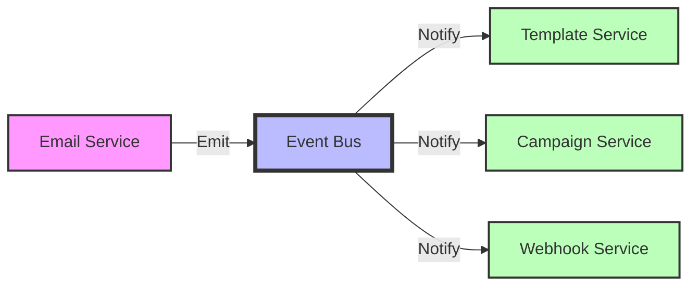
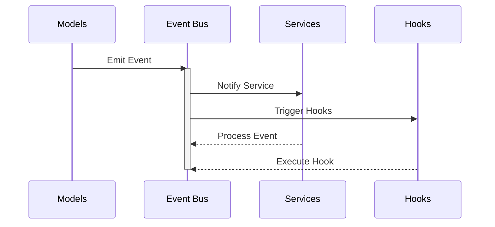
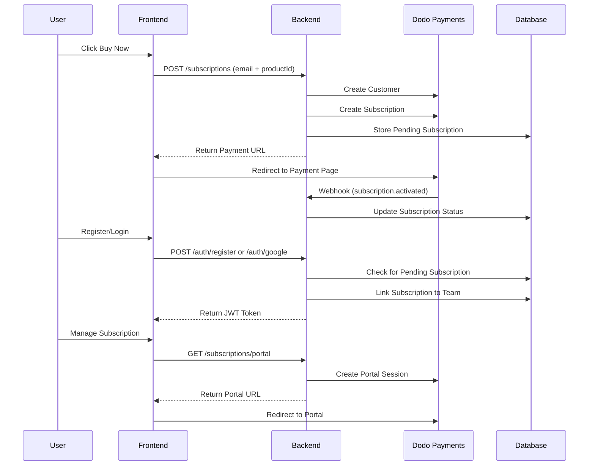

# Xem Backend

A Go-based backend service for email campaign management with authentication and permission systems.

## Features

### Authentication System

The auth system covers the basics you'd expect - JWT tokens with refresh capability, role-based access control, password resets with timed codes, and API keys with specific permissions. When you first run the app, it'll create a super admin account automatically.

### Permission System

Permissions work at the resource level and are organized by module. Each role gets its own set of default permissions, and you can use wildcards like "campaigns:*" to grant broad access when needed.

### What's Included

The backend handles ten main areas:

**Campaign Management** - Create and schedule email campaigns with automation support.

**Template Management** - Build and store HTML email templates.

**Contact Management** - Manage mailing lists, import/export contacts, and organize them with tags.

**Team Management** - Support for multiple teams with invitations and custom settings.

**User Management** - Three user roles (Super Admin, Admin, Member) with granular permission controls.

**API Key Management** - Generate keys with specific permissions and track their usage.

**Automation** - Set up email workflows with trigger-based actions and custom nodes.

**SMTP Configuration** - Connect multiple SMTP providers, test connections, and manage send rates.

**Domain Management** - Verify domains and handle DNS records for multiple domains.

**Webhook Management** - Create custom webhook endpoints with event triggers and delivery tracking.

### Event Bus System

Services communicate through an event bus, which keeps things decoupled and handles events asynchronously. It includes panic recovery so one failing handler won't bring everything down.


```mermaid
graph LR
    A[Email Service] -->|Emit| B[Event Bus]
    B -->|Notify| C[Template Service]
    B -->|Notify| D[Campaign Service]
    B -->|Notify| E[Webhook Service]
    
    style A fill:#f9f,stroke:#333,stroke-width:2px
    style B fill:#bbf,stroke:#333,stroke-width:4px
    style C fill:#bfb,stroke:#333,stroke-width:2px
    style D fill:#bfb,stroke:#333,stroke-width:2px
    style E fill:#bfb,stroke:#333,stroke-width:2px
```

### Event Flow Architecture


```mermaid
sequenceDiagram
    participant M as Models
    participant E as Event Bus
    participant S as Services
    participant H as Hooks
    
    M->>E: Emit Event
    activate E
    E->>S: Notify Service
    E->>H: Trigger Hooks
    S-->>E: Process Event
    H-->>E: Execute Hook
    deactivate E
```

### Available Events

| Event Name | Description | Payload |
|------------|-------------|---------|
| email.sent | Triggered when email is sent | EmailData |
| template.updated | Triggered on template changes | TemplateData |
| campaign.started | Triggered when campaign starts | CampaignData |
| user.registered | Triggered on new registration | UserData |
| team.created | Triggered when a new team is created | TeamData |

Here's how you use it:

```go
// Register event handler
events.On("email.sent", func(data interface{}) {
    // Handle email sent event
})

// Emit event
events.Emit("email.sent", emailData)
```

## Getting Started

### Prerequisites

You'll need Go 1.21+, PostgreSQL 14+, and Redis for rate limiting and caching.

### Environment Variables

```env
# Server Configuration
SERVER_HOST=localhost
SERVER_PORT=8080

# Database Configuration
POSTGRES_HOST=localhost
POSTGRES_PORT=5432
POSTGRES_USER=kori_user
POSTGRES_PASSWORD=kori_password
POSTGRES_DB=kori
POSTGRES_SSLMODE=disable

# JWT Configuration
JWT_SECRET=your_secure_jwt_secret

# Storage Configuration
STORAGE_PROVIDER=local
STORAGE_BASE_PATH=./storage

# Worker Configuration
WORKER_CONCURRENCY=5
WORKER_QUEUE_SIZE=100

# Redis Configuration
REDIS_HOST=localhost
REDIS_PORT=6379
REDIS_PASSWORD=kori_password
REDIS_DB=0

# Super Admin Configuration (First Run)
SUPERADMIN_EMAIL=admin@example.com
SUPERADMIN_PASSWORD=secure_password
SUPERADMIN_NAME=Admin
```

### Installation

Clone the repo and install dependencies:

```bash
git clone https://github.com/mailexem/Xem.go.git xem
cd xem
go mod download
```

Set up your environment:

```bash
cp .env.example .env
# Edit .env with your configuration
```

Start the server:

```bash
go run cmd/server/main.go
```

### API Documentation

The API docs use Swagger/OpenAPI. You can access them at:

- **Swagger UI**: `http://localhost:8080/swagger/index.html`
- **OpenAPI 3.0 JSON**: `openapi.json` (generated file)
- **Swagger 2.0 JSON**: `http://localhost:8080/swagger/doc.json`
- **Swagger 2.0 YAML**: `http://localhost:8080/swagger/doc.yaml`

Generate or update docs:

```bash
# Generate Swagger 2.0 documentation
make docs

# Generate OpenAPI 3.0 specification (openapi.json)
make openapi

# Using the scripts
./scripts/swagger.sh generate
./scripts/generate-openapi.sh generate

# Serve documentation locally
./scripts/swagger.sh serve
```

The docs let you test endpoints right in the browser, with pre-filled examples and full authentication support. Everything's organized by functional area with complete model schemas and error responses.

### API Categories

- **Authentication** - Registration, login, token management
- **Teams** - Team management and collaboration
- **Campaigns** - Campaign creation, management, tracking
- **Analytics** - Performance metrics and insights
- **Contacts** - Contact and mailing list operations
- **Templates** - Email template customization
- **Automations** - Workflow automation and triggers
- **SMTP** - Email delivery settings
- **IMAP** - Inbox management configuration
- **Webhooks** - Real-time event notifications
- **Files** - Upload and manage attachments
- **Domains** - Email authentication setup
- **API Keys** - Programmatic access management

Check `docs/README.md` for more details on documentation management.

## Authentication

### Registration

```http
POST /api/v1/auth/register
{
    "email": "user@example.com",
    "password": "secure_password",
    "first_name": "John",
    "last_name": "Doe"
}
```

### Login

```http
POST /api/v1/auth/login
{
    "email": "user@example.com",
    "password": "secure_password"
}
```

### Password Reset

```http
POST /api/v1/auth/password-reset
{
    "email": "user@example.com"
}
```

### Authentication System Architecture

The system supports email/password auth and Google OAuth, both integrated with JWT session management.


```mermaid
graph TD
    subgraph "Traditional Email/Password Authentication"
        A[User Registration/Login] -->|Email & Password| B{Exists?}
        B -->|No - Register| C[Create Team & User]
        C --> D[Assign Default Permissions]
        B -->|Yes - Login| E[Validate Password]
        D --> F[Generate Tokens]
        E -->|Valid| F
        E -->|Invalid| G[Return Error]
        F --> H[Create Auth Transaction]
        H --> I[Return JWT & Refresh Token]
    end

    subgraph "Google OAuth Authentication"
        J[Google Sign-In] -->|ID Token| K[Verify with Firebase]
        K -->|Valid| L{User Exists?}
        L -->|No| M[Create Team & User]
        M --> N[Assign Default Permissions]
        L -->|Yes| O[Update Provider Data]
        N --> P[Generate Tokens]
        O --> P
        P --> Q[Create Auth Transaction]
        Q --> R[Return JWT & Refresh Token]
    end

    subgraph "JWT Token Flow"
        S[Protected API Request] -->|JWT Token| T[Auth Middleware]
        T -->|Validate| U{Token Valid?}
        U -->|Yes| V[Extract Claims]
        V --> W[Set Context]
        W --> X[Continue to Handler]
        U -->|No| Y[Return 401]
    end

    subgraph "Token Refresh Flow"
        Z[Refresh Token Request] -->|Refresh Token| AA{Valid?}
        AA -->|Yes| AB[Get User]
        AB --> AC[Generate New Access Token]
        AC --> AD[Update Auth Transaction]
        AD --> AE[Return New Access Token]
        AA -->|No| AF[Return 401]
    end

    subgraph "Password Reset Flow"
        AG[Reset Request] -->|Email| AH[Generate Reset Code]
        AH --> AI[Store Reset Code]
        AI --> AJ[Send Reset Email]
        AK[Reset Verification] -->|Code & New Password| AL{Valid Code?}
        AL -->|Yes| AM[Update Password]
        AM --> AN[Mark Code Used]
        AL -->|No| AO[Return Error]
    end

    subgraph "Team Invite Flow"
        AP[Team Invite] -->|Email & Role| AQ[Generate Invite Code]
        AQ --> AR[Store Invite]
        AR --> AS[Send Invite Email]
        AT[Accept Invite] -->|Code & Password| AU{Valid Invite?}
        AU -->|Yes| AV[Create User]
        AV --> AW[Assign Team & Role]
        AU -->|No| AX[Return Error]
    end
```

### Key Components

**Authentication Methods** - Email/password, Google OAuth via Firebase, and team invitations.

**Token Management** - JWT access tokens valid for 24 hours, refresh tokens for 7 days, with full transaction tracking.

**User Management** - Automatic team creation, role assignment, and permission management.

**Security Features** - Bcrypt password hashing, time-limited reset codes, Firebase token verification, and transaction-based operations.

**Integration Points** - Firebase Authentication, email service for notifications, and event system for tracking.

### Authentication Endpoints

```http
# Traditional Authentication
POST /api/v1/auth/register     # User Registration
POST /api/v1/auth/login        # User Login
POST /api/v1/auth/refresh      # Token Refresh

# Google OAuth
POST /api/v1/auth/google       # Google Sign-In

# Password Management
POST /api/v1/auth/password-reset         # Request Reset
POST /api/v1/auth/password-reset/verify  # Verify Reset

# Team Management
POST /api/v1/auth/invite       # Send Team Invite
POST /api/v1/auth/accept/:code # Accept Invite
```

## Subscription System

The subscription system uses Dodo Payments for flexible subscription management with feature-based access control.


```mermaid
sequenceDiagram
    participant U as User
    participant F as Frontend
    participant B as Backend
    participant D as Dodo Payments
    participant DB as Database

    %% Initial Purchase Flow
    U->>F: Click Buy Now
    F->>B: POST /subscriptions (email + productId)
    B->>D: Create Customer
    B->>D: Create Subscription
    B->>DB: Store Pending Subscription
    B-->>F: Return Payment URL
    F->>D: Redirect to Payment Page
    D->>B: Webhook (subscription.activated)
    B->>DB: Update Subscription Status

    %% User Registration/Login Flow
    U->>F: Register/Login
    F->>B: POST /auth/register or /auth/google
    B->>DB: Check for Pending Subscription
    B->>DB: Link Subscription to Team
    B-->>F: Return JWT Token

    %% Subscription Management Flow
    U->>F: Manage Subscription
    F->>B: GET /subscriptions/portal
    B->>D: Create Portal Session
    B-->>F: Return Portal URL
    F->>D: Redirect to Portal
```

### Key Components

Products define their features and pricing:

```go
type Product struct {
    Name        string
    Description string
    Price       float64
    Interval    string    // monthly, yearly
    Features    []ProductFeatureConfig
}

type ProductFeature string
const (
    FeatureEmailCampaigns    ProductFeature = "email_campaigns"
    FeatureTemplateLibrary   ProductFeature = "template_library"
    FeatureAdvancedAnalytics ProductFeature = "advanced_analytics"
    // ... more features
)
```

Subscriptions can be in different states:

```go
type SubscriptionStatus string
const (
    SubscriptionStatusPending  SubscriptionStatus = "pending"
    SubscriptionStatusActive   SubscriptionStatus = "active"
    SubscriptionStatusCanceled SubscriptionStatus = "canceled"
    SubscriptionStatusPaused   SubscriptionStatus = "paused"
    SubscriptionStatusFailed   SubscriptionStatus = "failed"
)
```

### Subscription Flow

**Pre-Purchase** - User picks a plan, backend creates pending subscription, redirects to Dodo Payments.

**Account Creation** - After payment, user registers or logs in. System matches email with pending subscription and links it to the team.

**Feature Access** - Products define enabled features. System checks access via `HasFeature()` with optional limits per feature.

**Management** - Team admins access the subscription portal to change plans or cancel. Webhooks handle updates automatically.

### API Endpoints

```http
# Public Endpoints
POST   /api/v1/subscriptions         # Create subscription
POST   /api/v1/subscriptions/webhook # Handle Dodo webhooks

# Protected Endpoints (Requires Auth)
GET    /api/v1/subscriptions/portal   # Get management portal URL
GET    /api/v1/subscriptions/features # Get enabled features
```

### Security Features

**Access Control** - Only team admins can manage subscriptions. Feature checks on protected endpoints and webhook signature verification.

**Data Integrity** - Transaction-based updates, email verification for linking, and secure portal access through Dodo Payments.

**State Management** - Automatic status updates via webhooks, period tracking for billing cycles, and trial period support.

### Configuration

```env
# Dodo Payments Configuration
DODO_API_KEY=your_dodo_api_key
DODO_WEBHOOK_SECRET=your_dodo_webhook_secret
APP_ENV=development # or production
```

## Security Features

**Rate Limiting** - Request limits per IP, API key rate limiting, and configurable thresholds.

**JWT Security** - Short-lived access tokens (24 hours), refresh token support (7 days), and permission claims in tokens.

**Password Security** - Bcrypt hashing, minimum requirements, and secure reset flow.

**API Security** - CORS protection, request size limiting, secure headers, and GZIP compression.

## Development

### Project Structure

```
xem
├── cmd                     # Application entry points
├── internal               
│   ├── api                  # API layer
│   │   ├── middleware         # Custom middlewares
│   │   ├── validator          # Request validators
│   │   └── server.go          # Server setup
│   ├── config               # Configuration
│   ├── events               # Event bus system
│   ├── handlers             # Request handlers
│   ├── models               # Database models
│   ├── routes               # Route definitions
│   ├── services             # Business logic
│   └── utils                # Utility functions
├── migrations             # Database migrations
└── storage                # Local storage
```

### Adding New Features

For a new resource, add the model in `internal/models/`, add permissions in `internal/models/seed.go`, create a handler in `internal/handlers/`, and add routes in `internal/routes/`.

For new permissions, add the resource in `defaultResources`, add permissions in `rolePermissions`, then run the server to auto-seed.

## License

This project is licensed under the MIT License - see the LICENSE file for details.